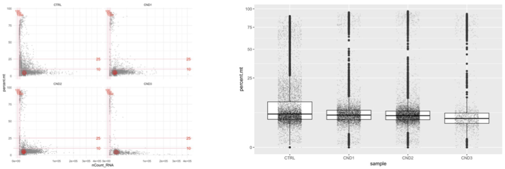
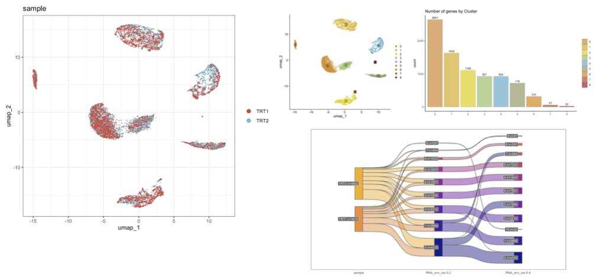
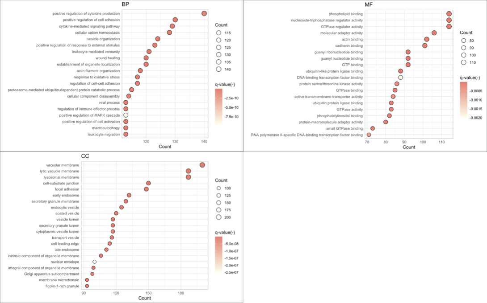
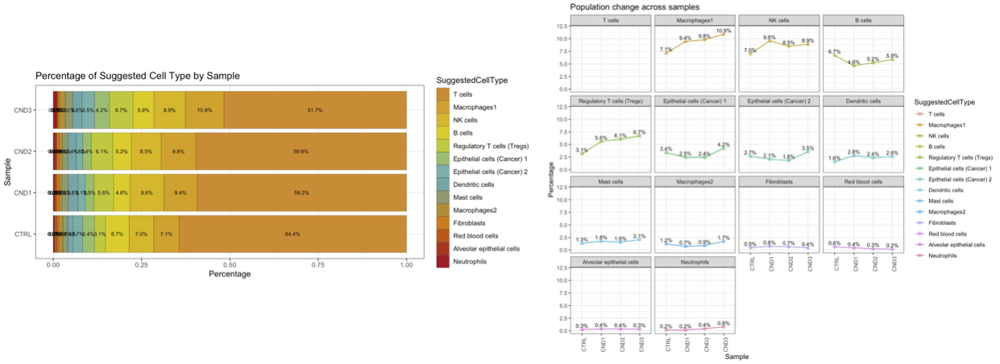
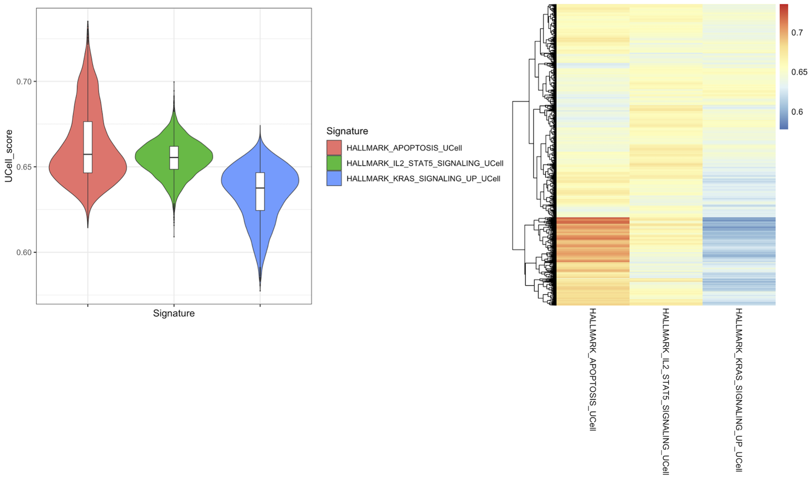

```{r setup, include=FALSE}
knitr::opts_chunk$set(echo = TRUE, eval = F)
```
<br>

[Link to the previous version](https://sung2021.github.io/samplePages/scRNAseq.html)  
<br><br>


### Initial Processing  

* [**Raw data processing **](https://sung2021.github.io/works.io/samples/processing/scRNA_preprocessing.html)<br>
    * cellranger  
    * doublet removal   
<br>

* [**Raw data filitering by UMI & mitochondrial content**](https://sung2021.github.io/works.io/samples/processing/scRNA_QC.html)  
<br>
<br><br>  

### UMAP/Clustering/markers  

  * [**UMAP/Clustering/markers**](scRNA/scRNA_UMAP.html)  
<br>
<br><br>
  * [**GSEA by cluster marker genes**](scRNA/Daiichi2024_30342.24.05.11.clusterGSEA.html)<br>
<br>
<br><br> 

### Marker gene Analyais   

  * [**Marker genes**](scRNA/scRNA_UMAP.html)  
<br><br><br>  

### Functional analysis  

  * [**Population shift**](scRNA/Daiichi2024_30342.24.05.12.analysis_population.html)  
<br>

  * [**Gene signature scoring**](scRNA/scRNA_scoring.html)<br>
  
<br>  
  
  * [**Differentially Exprssed Genes Analysis between selected groups**](scRNA/scRNA_scoring.html)<br>

 
  * [**GSVA**](scRNA/scRNA_scoring.html)   
  
  
  