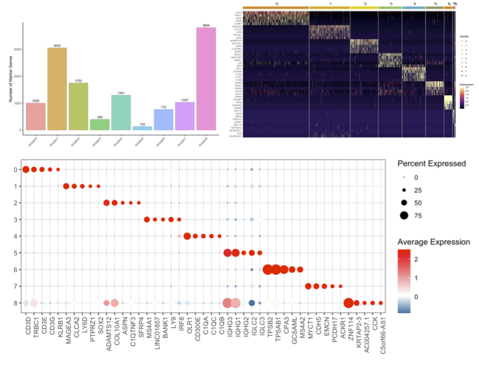
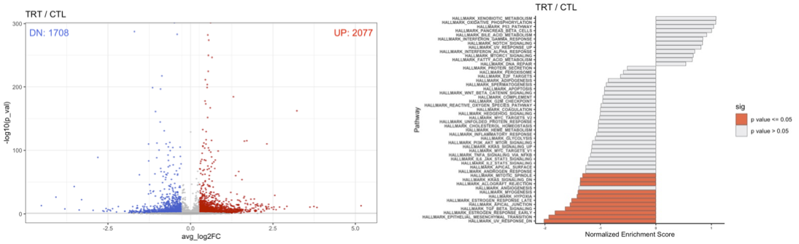
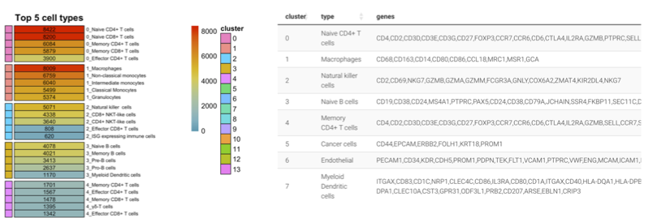
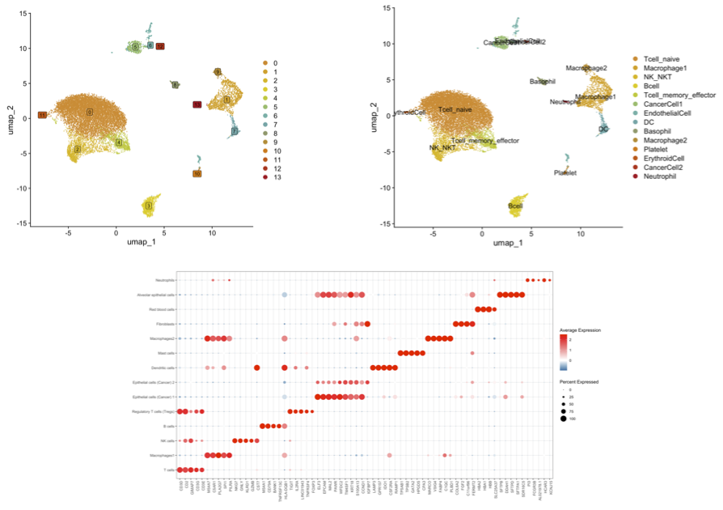

```{r setup, include=FALSE}
knitr::opts_chunk$set(echo = TRUE, eval = F)
```
<br>

[Link to the previous version](https://sung2021.github.io/samplePages/scRNAseq.html)  
<br><br>


### Initial Processing  

* [**Raw data processing **](https://sung2021.github.io/works.io/samples/processing/scRNA_preprocessing.html)<br>
    * cellranger  
    * doublet removal   
<br>

* [**Raw data filitering by UMI & mitochondrial content**](https://sung2021.github.io/works.io/samples/processing/scRNA_QC.html)<br>
<a href="https://sung2021.github.io/works.io/samples/processing/scRNA_QC.html"></a><br>
<br><br>  

### UMAP/Clustering  

  * [**UMAP/Clustering**](scRNA/Daiichi.example.UMAP.html)  
<a href="scRNA/Daiichi.example.UMAP.html"></a><br>
<br><br>
  * [**Simple Gene Ontology analysis by cluster marker genes**](scRNA/Daiichi2024_30342.24.05.11.clusterGSEA.html)<br>
<a href="scRNA/Daiichi2024_30342.24.05.11.clusterGSEA.html"></a><br>
<br><br> 

### Marker gene Analyais   

  * [**Marker genes summary report**](scRNA/Daiichi.example.markers.html)  
<br>
<a href="scRNA/Daiichi.example.markers.html"></a><br>
<br><br>
<br><br>  

### Differentially Expressed Genes Analyais   

  * [**DEG report**](scRNA/Daiichi2024_30342.DEG.html)<br>
<a href="scRNA/Daiichi2024_30342.DEG.html"></a><br>
<br><br>
  

### Cell Type annotation    

  * [**Immune Cell Type Annotation by scType**](scRNA/scRNA_scType.html)<br>  
<a href="scRNA/scRNA_scType.html"></a><br>  
  
  * [**Manual Annotation by marker genes**](scRNA/Daiichi2024_30342.24.05.12.suggestedAnnotation.html)<br>
<a href="scRNA/Daiichi2024_30342.24.05.12.suggestedAnnotation.html"></a><br>
<br><br> 

### Functional analysis  

  * [**Population shift**](scRNA/Daiichi2024_30342.24.05.12.analysis_population.html)  
<a href="scRNA/Daiichi2024_30342.24.05.12.analysis_population.html"></a><br>

  * [**Gene signature scoring**](scRNA/scRNA_scoring.html)<br>
    * UCell<br>
<a href="scRNA/scRNA_scoring.html">
    
</a>
  
  <!-- * [**Differentially Exprssed Genes Analysis between selected groups**](scRNA/scRNA_scoring.html)<br> -->
 
  * [**scGSVA**](scRNA/scGSVA_template.html)
    * scGSVA (single-cell Gene Set Variation Analysis) 
    * An unsupervised, gene set enrichment method that estimates the activation states of gene sets at the single-cell level
  
  
  